#  vuejs简单入门

# 1. VueJS 概述与快速入门

## 1.1 MVVM模式

先聊一下前端开发模式的发展。

> 静态页面

最初的网页以HTML为主，是纯静态的网页。网页是只读的，信息流只能从服务端到客户端单向流通。**开发人员也只关心页面的样式和内容**即可。

> 异步刷新，操作DOM

1995年，网景工程师Brendan Eich 花了10天时间设计了JavaScript语言.

随着JavaScript的诞生，我们可以操作页面的DOM元素及样式，页面有了一些动态的效果，但是依然是以静态为主。

ajax盛行：

- 2005年开始，ajax逐渐被前端开发人员所重视，因为不用刷新页面就可以更新页面的数据和渲染效果。
- 此时的**开发人员不仅仅要编写HTML样式，还要懂ajax与后端交互，然后通过JS操作Dom元素来实现页面动态效果**。比较流行的框架如Jquery就是典型代表。

> MVVM，关注模型和视图

2008年，google的Chrome发布，随后就以极快的速度占领市场，超过IE成为浏览器市场的主导者。

2009年，Ryan Dahl在谷歌的Chrome V8引擎基础上，打造了基于事件循环的异步IO框架：Node.js。

- 基于事件循环的异步IO
- 单线程运行，避免多线程的变量同步问题
- JS可以编写后台代码，前后台统一编程语言

node.js的伟大之处不在于让JS迈向了后端开发，而是构建了一个庞大的生态系统。

2010年，NPM作为node.js的包管理系统首次发布，开发人员可以遵循Common.js规范来编写Node.js模块，然后发布到NPM上供其他开发人员使用。目前已经是世界最大的包模块管理系统。

随后，在node的基础上，涌现出了一大批的前端框架：

 

> MVVM模式

MVVM是Model-View-ViewModel的简写。它本质上就是MVC 的改进版。MVVM 就是将其中的View 的状态和行为抽象化，让我们将视图 UI 和业务逻辑分开。

- M：即Model，模型，包括数据和一些基本操作
- V：即View，视图，页面渲染结果
- VM：即View-Model，模型与视图间的双向操作（无需开发人员干涉）

MVVM模式和 MVC 模式一样，主要目的是分离视图 ( View ) 和模型 ( Model ) 

在MVVM之前，开发人员从后端获取需要的数据模型，然后要通过DOM操作Model渲染到View中。而后当用户操作视图，我们还需要通过DOM获取View中的数据，然后同步到Model中。

而MVVM中的VM要做的事情就是把DOM操作完全封装起来，开发人员不用再关心Model和View之间是如何互相影响的：

- 只要我们Model发生了改变，View上自然就会表现出来。
- 当用户修改了View，Model中的数据也会跟着改变。

把开发人员从繁琐的DOM操作中解放出来，把关注点放在如何操作Model上。

Vue.js 是一个提供了 MVVM 风格的双向数据绑定的 Javascript 库，专注于View 层。它的核心是 MVVM 中的 VM， 也就是ViewModel。 ViewModel 负责连接 View 和 Model，保证视图和数据的一致性，这种轻量级的架构让前端开发更加高效、便捷。

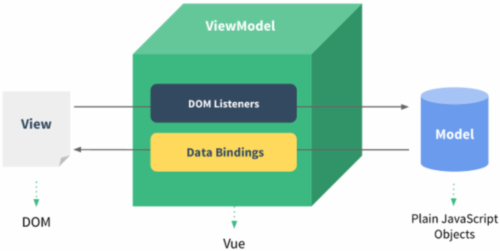 

## 1.2 VueJS介绍

Vue (读音 /vjuː/，类似于 **view**) 是一套用于构建用户界面的**渐进式框架**。与其它大型框架不同的是，Vue 被设计为可以自底向上逐层应用。Vue 的核心库只关注视图层，不仅易于上手，还便于与第三方库或既有项目整合。另一方面，当与现代化的工具链以及各种支持类库结合使用时，Vue 也完全能够为复杂的单页应用提供驱动。

前端框架三巨头：Vue.js、React.js、AngularJS，vue.js以其轻量易用著称，vue.js和React.js发展速度最快，AngularJS还是老大。

官网：https://cn.vuejs.org/

参考：https://cn.vuejs.org/v2/guide/

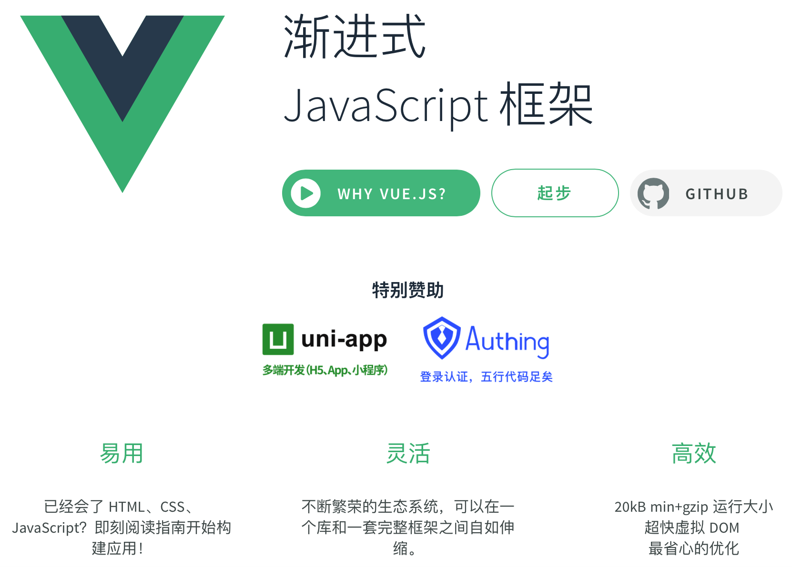 

Git地址：https://github.com/vuejs


**尤雨溪**，Vue.js 创作者，Vue Technology创始人，致力于Vue的研究开发。

# 2 Node和NPM

前面说过，NPM是Node提供的模块管理工具，可以非常方便的下载安装很多前端框架，包括Jquery、AngularJS、VueJs都有。为了后面学习方便，我们先安装node及NPM工具。

## 2.1 下载Node.js

下载地址：https://nodejs.org/en/

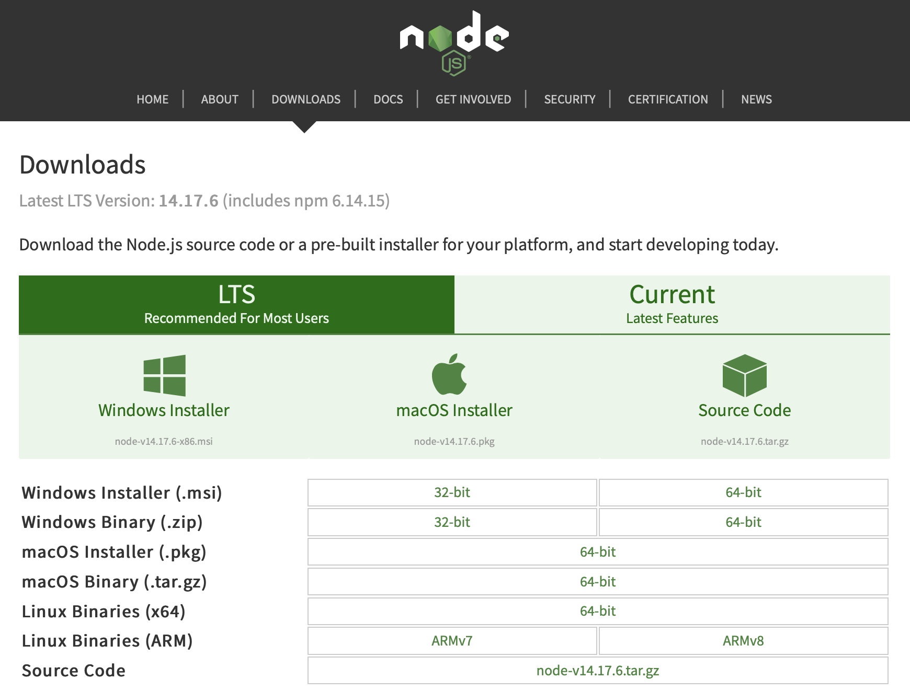  

推荐下载LTS版本。

课程中采用的是14.17.6版本。也是目前最新的。大家自行下载或者使用课前资料中提供的安装包。然后下一步安装即可。

完成以后，在控制台输入：

```bash
node -v
```

看到版本信息：

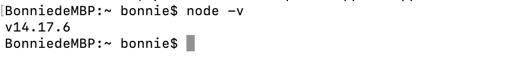 

## 2.2 NPM

Node自带了NPM了，在控制台输入`npm -v`查看：

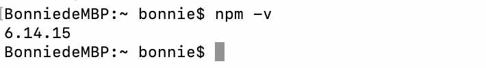 

npm默认的仓库地址是在国外网站，速度较慢，建议大家设置到淘宝镜像。但是切换镜像是比较麻烦的。推荐一款切换镜像的工具：nrm

我们首先安装nrm，这里`-g`代表全局安装。可能需要一点儿时间

```bash
 npm install nrm -g
```

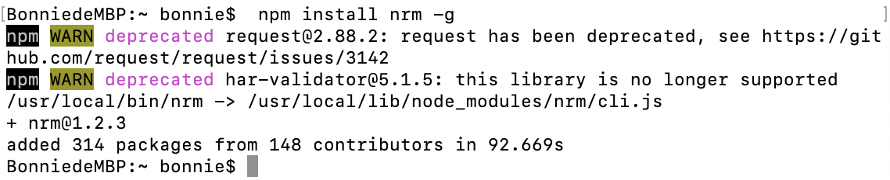 

然后通过`nrm ls`命令查看npm的仓库列表,带*的就是当前选中的镜像仓库：

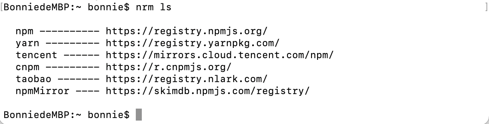 

通过`nrm use taobao`来指定要使用的镜像源：

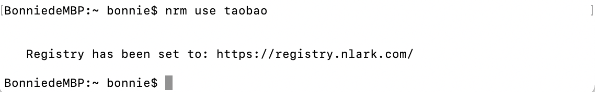 

然后通过`nrm test npm`来测试速度：

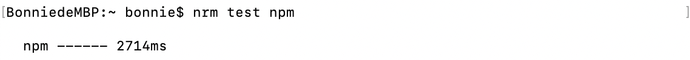 

注意：

- 有教程推荐大家使用cnpm命令，但是使用发现cnpm有时会有bug，不推荐。
- 安装完成请一定要重启下电脑！！！
- 安装完成请一定要重启下电脑！！！
- 安装完成请一定要重启下电脑！！！

# 3 VueJS 快速入门

接下来，我们快速领略下vue的魅力

## 3.1 创建工程

创建一个新的空工程：

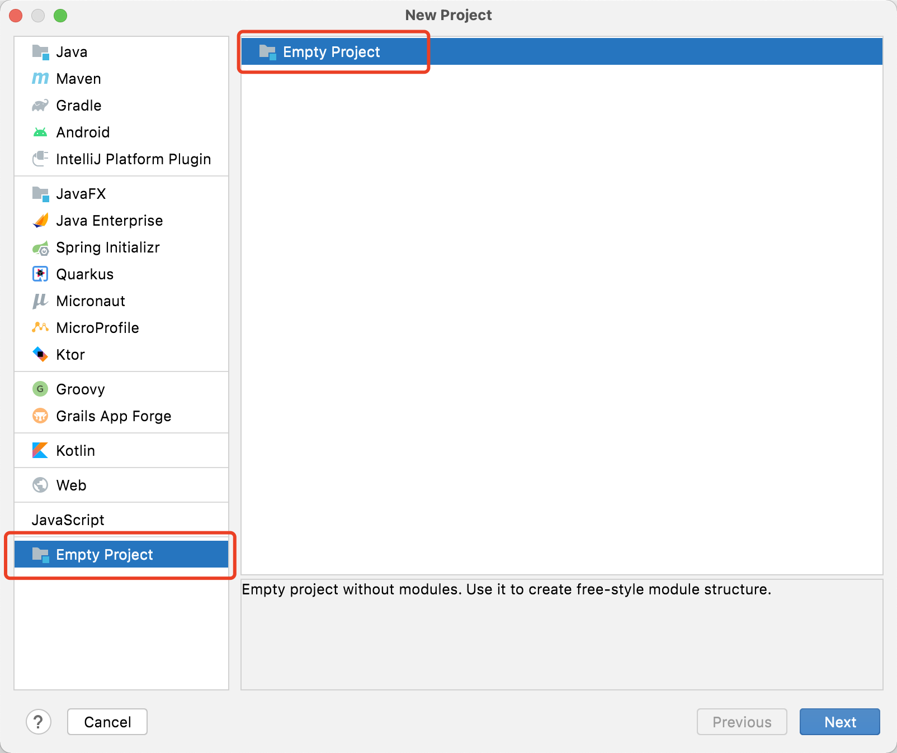 

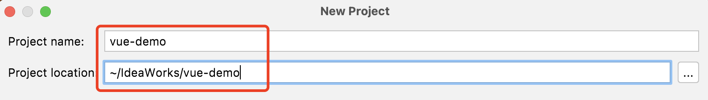  

然后新建一个module，选择静态web项目，起名hello-vue：

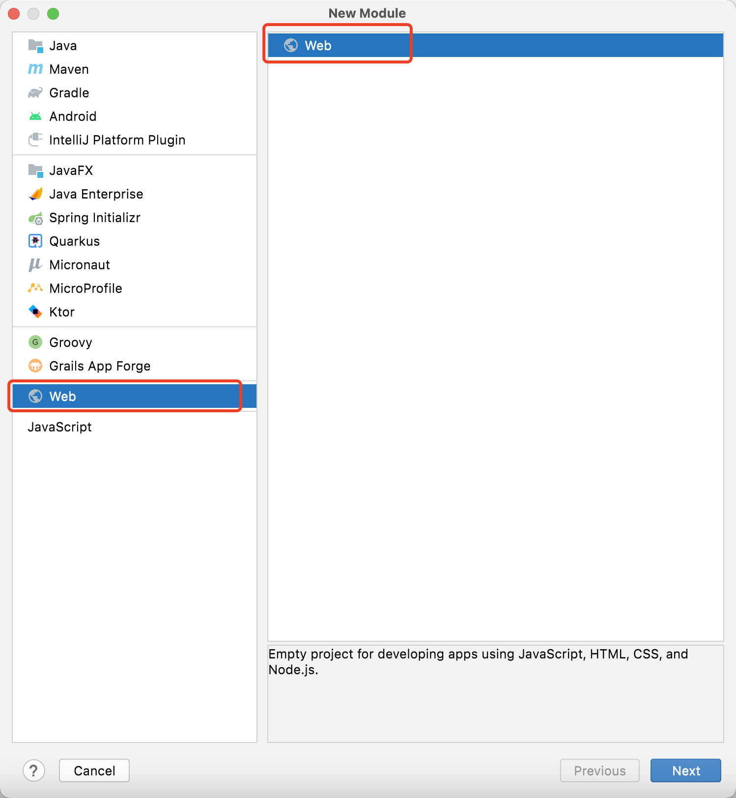 

## 3.2 安装vue

### 3.2.1 下载安装

下载地址：https://github.com/vuejs/vue

可以下载2.6.14版本https://github.com/vuejs/vue/archive/v2.6.14.zip

下载解压，得到vue.js文件。

### 3.2.2 使用CDN

或者也可以直接使用公共的CDN服务：

```html
<!-- 开发环境版本，包含了用帮助的命令行警告 -->
<script src="https://cdn.jsdelivr.net/npm/vue/dist/vue.js"></script>
```

或者：

```html
<!-- 生产环境版本，优化了尺寸和速度 -->
<script src="https://cdn.jsdelivr.net/npm/vue"></script>
```

### 3.2.3 推荐npm安装

在IDEA的左下角，有个Terminal按钮，点击打开控制台：

 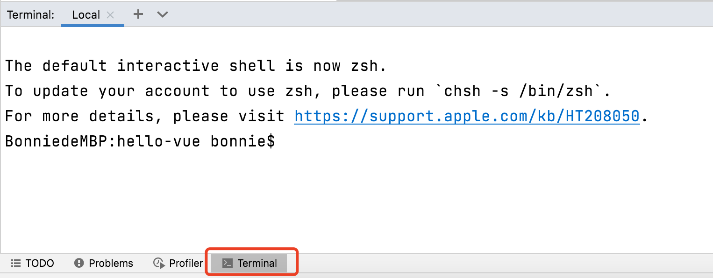 

进入hello-vue目录，先输入：`npm init -y` 进行初始化

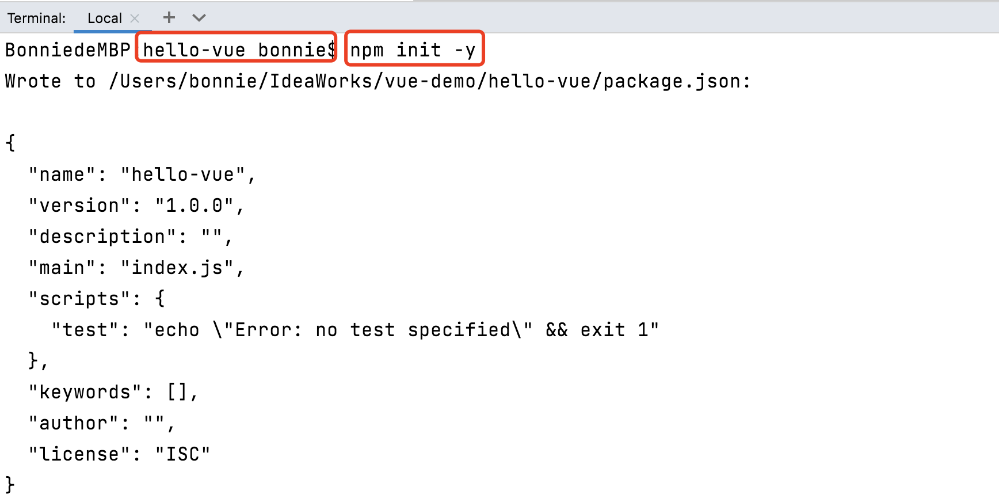  

安装Vue，输入命令：`npm install vue --save`

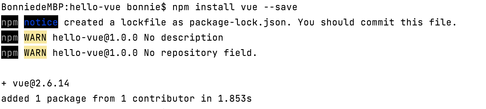  

然后就会在hello-vue目录发现一个node_modules目录，并且在下面有一个vue目录。

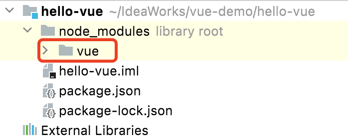 

node_modules是通过npm安装的所有模块的默认位置。

## 3.3 vue入门案例

### 3.3.1 HTML模板

 在hello-vue目录新建一个HTML

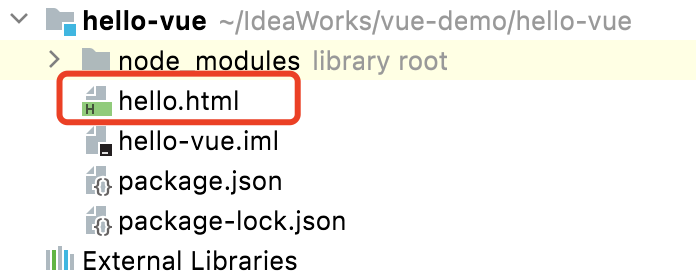 

```html
<body>
  <div>
    <h2>xx, 非常好看! !</h2>
  </div>
</body>
```

h2中要输出一句话：xx 非常好看。前面的xx是要渲染的数据。

### 3.3.2 vue声明式渲染

然后我们通过Vue进行渲染：

```html
<body>
  <div id="app">
    <h2>{{name}}，非常好看！！！</h2>
  </div>
</body>
<script src="node_modules/vue/dist/vue.js" ></script>
<script>
  // 创建vue实例
  var app = new Vue({
    el: "#app", // el即element，该vue实例要渲染的页面元素
    data: { // 渲染页面需要的数据
      name: "宝姐"
    }
  });
</script>
```

- 首先通过 new Vue()来创建Vue实例
- 然后构造函数接收一个对象，对象中有一些属性：
  - el：是element的缩写，通过id选中要渲染的页面元素，本例中是一个div
  - data：数据，数据是一个对象，里面有很多属性，都可以渲染到视图中
    - name：这里我们指定了一个name属性
- 页面中的`h2`元素中，我们通过{{name}}的方式，来渲染刚刚定义的name属性。

打开页面查看效果：

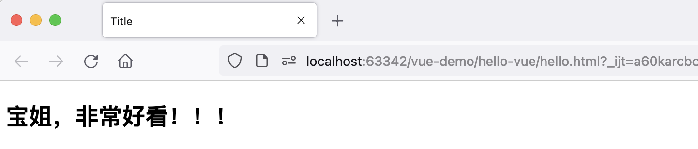 

更神奇的在于，当你修改name属性时，页面会跟着变化：

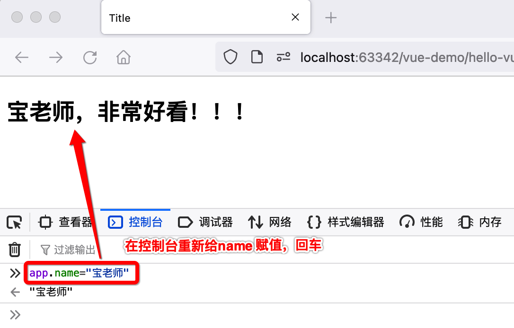 

###  3.3.3 双向绑定

我们对刚才的案例进行简单修改：

```html
<div id="app">
  <input type="text" v-model="num">
  <h2>
    {{name}}，非常好看！！！有{{num}}位男神为她着迷。
  </h2>
</div>

<script src="node_modules/vue/dist/vue.js"></script>
<script>
  // 创建vue实例
  var app = new Vue({
    el: "#app", // el即element，该vue实例要渲染的页面元素
    data: { // 渲染页面需要的数据
      name: "宝姐",
      num: 5
    }
  });
</script>
```

- 我们在data添加了新的属性：`num`
- 在页面中有一个`input`元素，通过`v-model`与`num`进行绑定。
- 同时通过`{{num}}`在页面输出

效果：

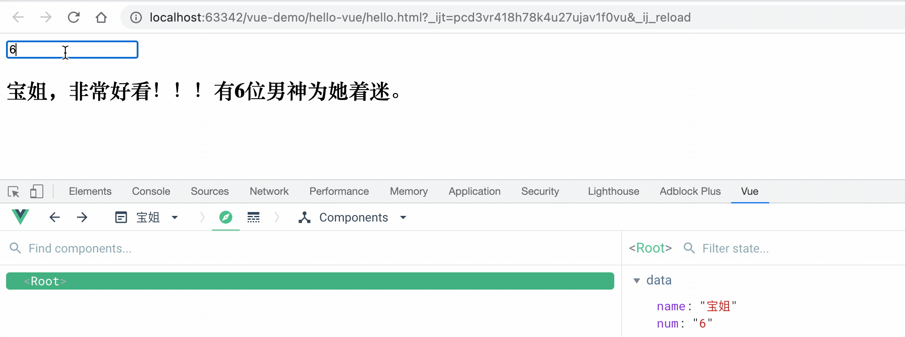 

我们可以观察到，输入框的变化引起了data中的num的变化，同时页面输出也跟着变化。

- input与num绑定，input的value值变化，影响到了data中的num值
- 页面`{{num}}`与数据num绑定，因此num值变化，引起了页面效果变化。

没有任何dom操作，这就是双向绑定的魅力。

### 3.3.4 事件处理

我们在页面添加一个按钮：

```html
<button v-on:click="num++">点我</button>
```

- 这里用`v-on`指令绑定点击事件，而不是普通的`onclick`，然后直接操作num
- 普通click是无法直接操作num的。

效果：

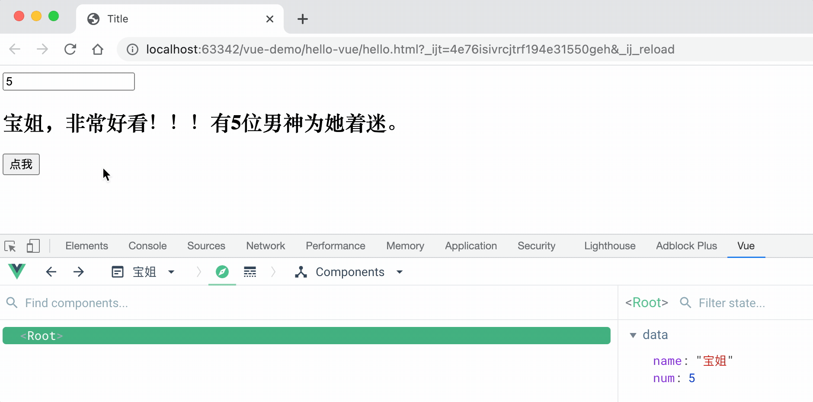 

# 4 Vue实例

## 4.1 创建Vue实例

每个 Vue 应用都是通过用 `Vue` 函数创建一个新的 **Vue 实例**开始的：

```javascript
var vm = new Vue({
  // 选项
})
```

在构造函数中传入一个对象，并且在对象中声明各种Vue需要的数据和方法，包括：

- el
- data
- methods

等等

接下来我们一 一介绍。

## 4.2 模板或元素

每个Vue实例都需要关联一段Html模板，Vue会基于此模板进行视图渲染。

我们可以通过el属性来指定。

例如一段html模板：

```html
<div id="app">
    
</div>
```

然后创建Vue实例，关联这个div

```js
var vm = new Vue({
	el: "#app"
})
```

这样，Vue就可以基于id为`app`的div元素作为模板进行渲染了。在这个div范围以外的部分是无法使用vue特性的。

## 4.3 数据

当Vue实例被创建时，它会尝试获取在data中定义的所有属性，用于视图的渲染，并且监视data中的属性变化，当data发生改变，所有相关的视图都将重新渲染，这就是“响应式“系统。

html：

```html
<div id="app">
  <input type="text" v-model="name"/>
</div>
```

js:

```js
var vm = new Vue({
  el:"#app",
  data: {
    name: "刘德华"
  }
})
```

- name的变化会影响到`input`的值
- input中输入的值，也会导致vm中的name发生改变

## 4.4 方法

Vue实例中除了可以定义data属性，也可以定义方法，并且在Vue实例的作用范围内使用。

html:

```html
<div id="app">
  {{num}}
  <button v-on:click="add">加</button>
</div>
```

js:

```js
var vm = new Vue({
  el: "#app",
  data: {
    num: 0
  },
  methods: {
    add: function(){
      // this代表的当前vue实例
      this.num++;
    }
  }
})
```

## 4.5 生命周期钩子

### 4.5.1 生命周期

每个 Vue 实例在被创建时都要经过一系列的初始化过程 ：创建实例，装载模板，渲染模板等等。Vue为生命周期中的每个状态都设置了钩子函数（监听函数）。每当Vue实例处于不同的生命周期时，对应的函数就会被触发调用。

生命周期：

```html
<!DOCTYPE html>
<html>
  <head>
    <meta charset="utf-8" />
    <title>快速入门</title>
    <script src="js/vue.min.js"></script>
  </head>
  <body>
    <div id="app">
      {{message}}
    </div>
    <script>
      new Vue({
        el:'#app', //表示当前vue对象接管了div区域
        data:{
          message:'hello world' //注意不要写分号结尾
        }
      });
    </script>
  </body>
</html>
```

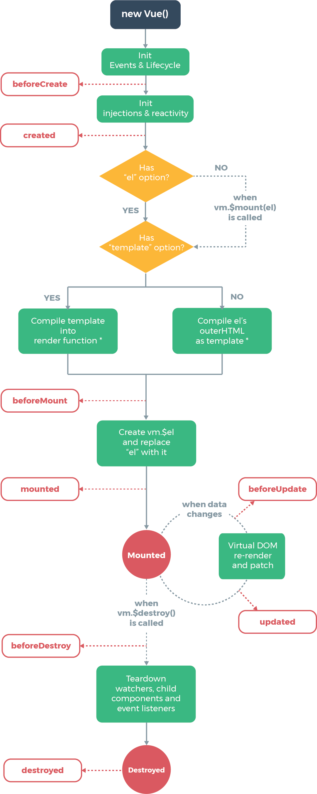 

### 4.5.2 钩子函数

- beforeCreated：我们在用Vue时都要进行实例化，因此，该函数就是在Vue实例化是调用，也可以将他理解为初始化函数比较方便一点，在Vue1.0时，这个函数的名字就是init。 
- created：在创建实例之后进行调用。 
- beforeMount：页面加载完成，没有渲染。如：此时页面还是{{name}}
- mounted：我们可以将他理解为原生js中的window.onload=function({.,.}),或许大家也在用jquery，所以也可以理解为jquery中的$(document).ready(function(){….})，他的功能就是：在dom文档渲染完毕之后将要执行的函数，该函数在Vue1.0版本中名字为compiled。 此时页面中的{{name}}已被渲染成宝姐
- beforeDestroy：该函数将在销毁实例前进行调用 。
- destroyed：改函数将在销毁实例时进行调用。
- beforeUpdate：组件更新之前。
- updated：组件更新之后。

例如：created代表在vue实例创建后；

我们可以在Vue中定义一个created函数，代表这个时期的钩子函数：

```js
// 创建vue实例
var app = new Vue({
  el: "#app", // el即element，该vue实例要渲染的页面元素
  data: { // 渲染页面需要的数据
    name: "宝姐",
    num: 5
  },
  methods: {
    add: function(){
      this.num--;
    }
  },
  created: function () {
    this.num = 100;
  }
});
```

结果：

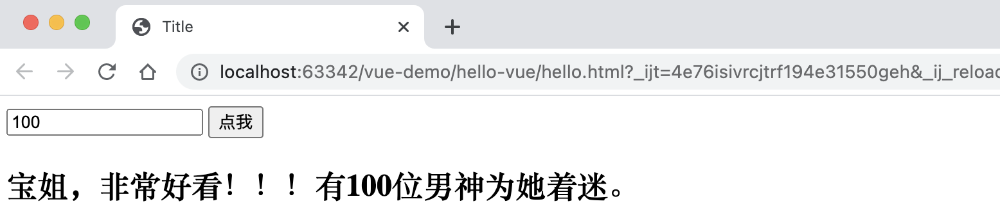  

### 4.5.3 this

我们可以看下在vue内部的this变量是谁，我们在created的时候，打印this

```js
methods: {
  add: function(){
    this.num--;
    console.log(this);
  }
},
```

 控制台的输出：

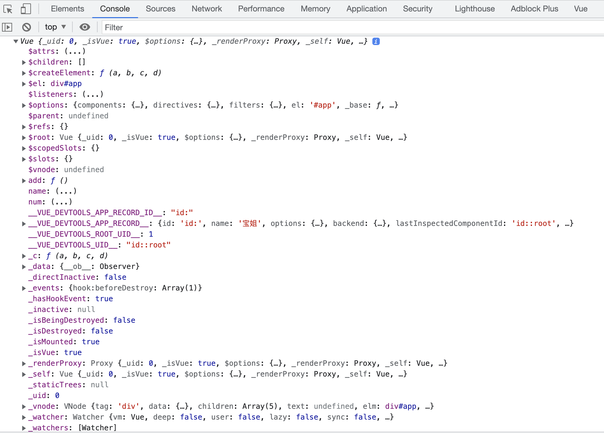  

# 5 指令

什么是指令？

指令 (Directives) 是带有 `v-` 前缀的特殊特性。指令特性的预期值是：**单个 JavaScript 表达式**。指令的职责是，当表达式的值改变时，将其产生的连带影响，响应式地作用于 DOM。 

例如我们在入门案例中的v-on，代表绑定事件。

## 5.1 插值表达式

数据绑定最常见的形式就是使用“Mustache”语法 ( 双大括号 ) 的文本插值，Mustache 标签将会被替代为对应数据对象上属性的值。无论何时，绑定的数据对象上属性发生了改变，插值处的内容都会更新。

### 5.1.1 花括号

格式：

```vue
{{ number + 1 }}

{{ ok ? 'YES' : 'NO' }}
```

这些表达式会在所属 Vue 实例的数据作用域下作为 JavaScript 被解析。有个限制就是，每个绑定都只能包含**单个表达式**，所以下面的例子都**不会**生效。

```vue
<!-- 这是语句，不是表达式 -->
{{ var a = 1 }}
<!-- 流控制也不会生效，请使用三元表达式 -->
{{ if (ok) { return message } }}
```

说明：

- 该表达式支持JS语法，可以调用js内置函数（必须有返回值）
- 表达式必须有返回结果。例如 1 + 1，没有结果的表达式不允许使用，如：var a = 1 + 1;
- 可以直接获取Vue实例中定义的数据或函数

示例：

HTML：

```html
<div id="app">{{name}}</div>
```

JS:

```js
var app = new Vue({
  el: "#app",
  data: {
    name: "Jack"
  }
})
```

### 5.1.2 插值闪烁

使用`{{}}`方式在网速较慢时会出现问题。在数据未加载完成时，页面会显示出原始的`{{}}`，加载完毕后才显示正确数据，我们称为插值闪烁。

我们将网速调慢一些，然后试试看刚才的案例：

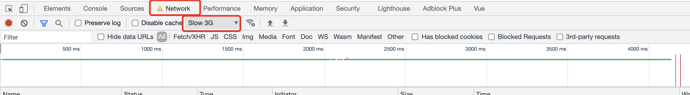 

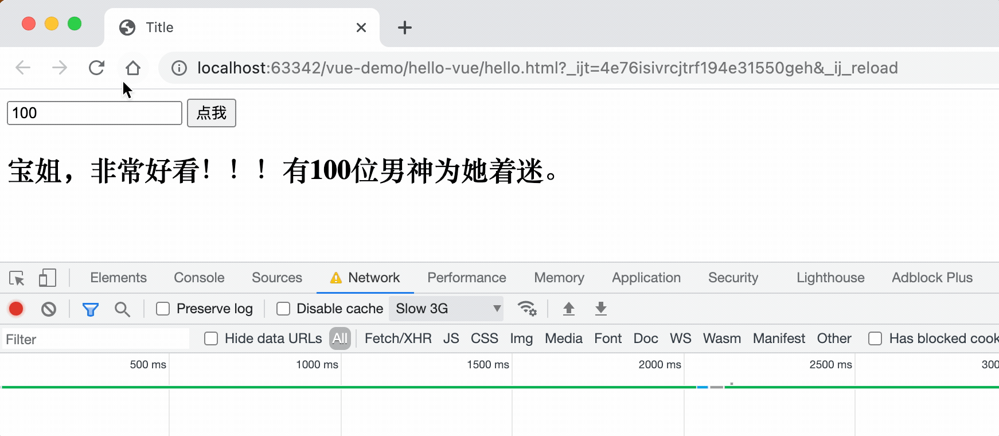 

### 5.1.3 v-text和v-html

使用v-text和v-html指令来替代`{{}}`

说明：

- v-text：将数据输出到元素内部，如果输出的数据有HTML代码，会作为普通文本输出
- v-html：将数据输出到元素内部，如果输出的数据有HTML代码，会被渲染

示例：

HTML:

```html
<div id="app">
  v-text:<span v-text="hello"></span> <br/>
  v-html:<span v-html="hello"></span>
</div>
```

JS:

```js
var vm = new Vue({
  el:"#app",
  data:{
    hello: "<h1>大家好，我是宝姐</h1>"
  }
})
```

效果：

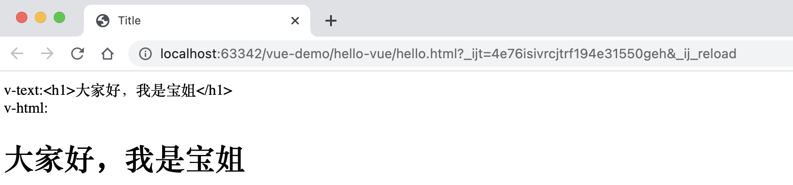 

并且不会出现插值闪烁，当没有数据时，会显示空白。

## 5.2 v-model

刚才的`v-text`和`v-html`可以看做是单向绑定，数据影响了视图渲染，但是反过来就不行。接下来学习的`v-model`是双向绑定，视图（View）和模型（Model）之间会互相影响。

既然是双向绑定，一定是在视图中可以修改数据，这样就限定了视图的元素类型。目前v-model的可使用元素有：

- input
- select
- textarea
- checkbox
- radio
- components（Vue中的自定义组件）

基本上除了最后一项，其它都是表单的输入项。

举例：

html：

```html
<div id="app">
  <input type="checkbox" v-model="language" value="Java" />Java<br/>
  <input type="checkbox" v-model="language" value="PHP" />PHP<br/>
  <input type="checkbox" v-model="language" value="Swift" />Swift<br/>
  <h1>
    你选择了：{{language.join(',')}}
  </h1>
</div>
<script src="./node_modules/vue/dist/vue.js"></script>
<script type="text/javascript">
  var vm = new Vue({
    el:"#app",
    data:{
      language: []
    }
  })
</script>
```

- 多个`CheckBox`对应一个model时，model的类型是一个数组，单个checkbox值默认是boolean类型
- radio对应的值是input的value值
- `input` 和`textarea` 默认对应的model是字符串
- `select`单选对应字符串，多选对应也是数组

效果：

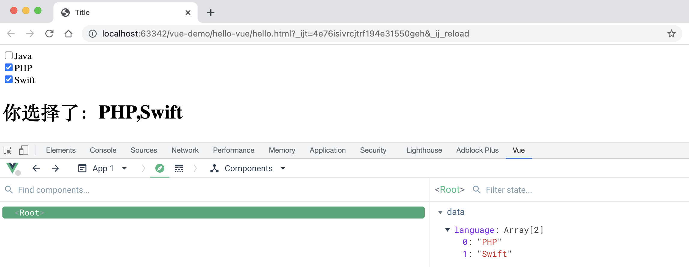 

## 5.3 v-on

### 5.3.1 基本用法

`v-on`指令用于给页面元素绑定事件。

语法：

```
v-on:事件名="js片段或函数名"
```

示例：

```html
<div id="app">
  <!--事件中直接写js片段-->
  <button v-on:click="num++">增加一个</button><br/>
  <!--事件指定一个回调函数，必须是Vue实例中定义的函数-->
  <button v-on:click="decrement">减少一个</button><br/>
  <h1>有{{num}}个男神迷恋宝姐</h1>
</div>
<script src="./node_modules/vue/dist/vue.js"></script>
<script type="text/javascript">
  var app = new Vue({
    el:"#app",
    data:{
      num:100
    },
    methods:{
      decrement(){
        this.num--;
      }
    }
  })
</script>
```

效果：

 

另外，事件绑定可以简写，例如`v-on:click='add'`可以简写为`@click='add'`

### 5.3.2 事件修饰符

在事件处理程序中调用 `event.preventDefault()` 或 `event.stopPropagation()` 是非常常见的需求。尽管我们可以在方法中轻松实现这点，但更好的方式是：方法只有纯粹的数据逻辑，而不是去处理 DOM 事件细节。

为了解决这个问题，Vue.js 为 `v-on` 提供了**事件修饰符**。修饰符是由点开头的指令后缀来表示的。

- `.stop` ：阻止事件冒泡到父元素
- `.prevent`：阻止默认事件发生
- `.capture`：使用事件捕获模式
- `.self`：只有元素自身触发事件才执行。（冒泡或捕获的都不执行）
- `.once`：只执行一次

阻止默认事件

```html
<div id="app">
  <!--右击事件，并阻止默认事件发生-->
  <button v-on:contextmenu.prevent="num++">增加一个</button>
  <br/>
  <!--右击事件，不阻止默认事件发生-->
  <button v-on:contextmenu="decrement($event)">减少一个</button>
  <br/>
  <h1>有{{num}}个男神迷恋宝姐</h1>
</div>
<script src="./node_modules/vue/dist/vue.js"></script>
<script type="text/javascript">
  var app = new Vue({
    el: "#app",
    data: {
      num: 100
    },
    methods: {
      decrement(ev) {
        // ev.preventDefault();
        this.num--;
      }
    }
  })
</script>
```

效果：（右键“增加一个”，不会触发默认的浏览器右击事件；右键“减少一个”，会触发默认的浏览器右击事件）

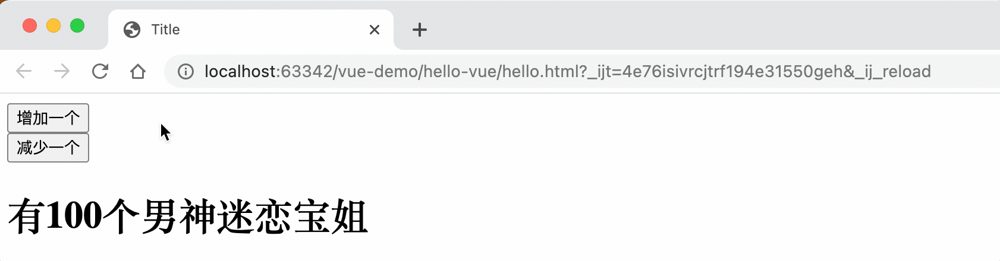

### 5.3.3 按键修饰符

在监听键盘事件时，我们经常需要检查常见的键值。Vue 允许为 `v-on` 在监听键盘事件时添加按键修饰符： 

```html
<!-- 只有在 `keyCode` 是 13 时调用 `vm.submit()` -->
<input v-on:keyup.13="submit">
```

记住所有的 `keyCode` 比较困难，所以 Vue 为最常用的按键提供了别名：

```html
<!-- 同上 -->
<input v-on:keyup.enter="submit">

<!-- 缩写语法 -->
<input @keyup.enter="submit">
```

全部的按键别名：

- `.enter`
- `.tab`
- `.delete` (捕获“删除”和“退格”键)
- `.esc`
- `.space`
- `.up`
- `.down`
- `.left`
- `.right`

### 5.3.4 组合按钮

可以用如下修饰符来实现仅在按下相应按键时才触发鼠标或键盘事件的监听器。

- `.ctrl`
- `.alt`
- `.shift`

例如：

```html
<!-- Alt + C -->
<input @keyup.alt.67="clear">

<!-- Ctrl + Click -->
<div @click.ctrl="doSomething">Do something</div>
```

## 5.4 v-for

遍历数据渲染页面是非常常用的需求，Vue中通过`v-for`指令来实现。

### 5.4.1 遍历数组

语法：

```javascript
v-for="item in items"
```

- items：要遍历的数组，需要在vue的data中定义好。
- item：迭代得到的数组元素的别名

示例

```html
<div id="app">
  <ul>
    <li v-for="user in users">
      {{user.name}} - {{user.gender}} - {{user.age}}
    </li>
  </ul>
</div>
<script src="./node_modules/vue/dist/vue.js"></script>
<script type="text/javascript">
  var app = new Vue({
    el: "#app",
    data: {
      users:[
        {name:'柳岩', gender:'女', age: 21},
        {name:'峰哥', gender:'男', age: 18},
        {name:'范冰冰', gender:'女', age: 24},
        {name:'刘亦菲', gender:'女', age: 18},
        {name:'古力娜扎', gender:'女', age: 25}
      ]
    },
  })
</script>
```

效果：

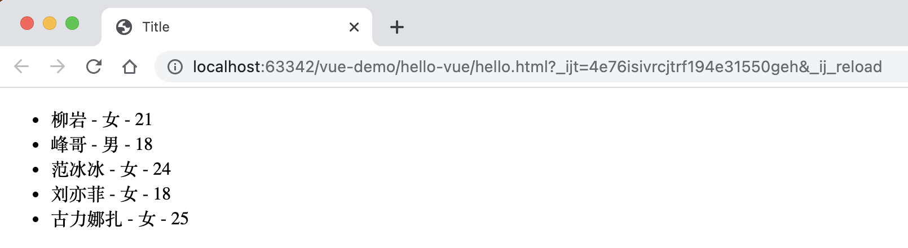  

### 5.4.2 数组角标

在遍历的过程中，如果我们需要知道数组角标，可以指定第二个参数：

语法

```javascript
v-for="(item,index) in items"
```

- items：要迭代的数组
- item：迭代得到的数组元素别名
- index：迭代到的当前元素索引，从0开始。

示例

```html
<ul>
  <li v-for="(user, index) in users">
    {{index + 1}}. {{user.name}} - {{user.gender}} - {{user.age}}
  </li>
</ul>
```

效果：

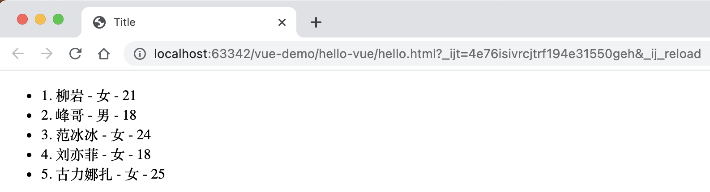  

### 5.4.3 遍历对象

`v-for`除了可以迭代数组，也可以迭代对象。语法基本类似

语法：

```javascript
v-for="value in object"
v-for="(value,key) in object"
v-for="(value,key,index) in object"
```

- 1个参数时，得到的是对象的属性
- 2个参数时，第一个是属性，第二个是键
- 3个参数时，第三个是索引，从0开始

示例：

```html
<div id="app">
  <ul>
    <li v-for="(value, key, index) in user">
      {{index + 1}}. {{key}} - {{value}}
    </li>
  </ul>
</div>
<script src="./node_modules/vue/dist/vue.js"></script>
<script type="text/javascript">
  var vm = new Vue({
    el:"#app",
    data:{
      user:{name:'宝姐', gender:'男', age: 18}
    }
  })
</script>
```

效果：

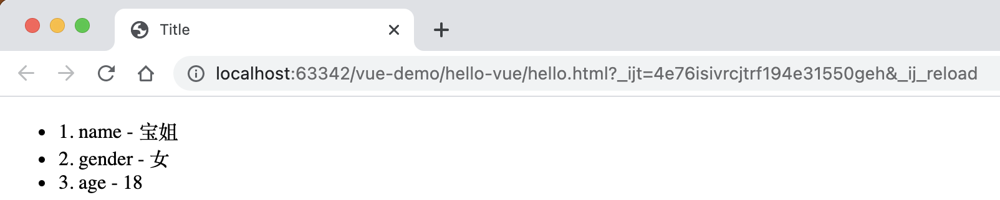  

### 5.4.4 key

当 Vue.js 用 `v-for` 正在更新已渲染过的元素列表时，它默认用“就地复用”策略。如果数据项的顺序被改变，Vue 将不会移动 DOM 元素来匹配数据项的顺序， 而是简单复用此处每个元素，并且确保它在特定索引下显示已被渲染过的每个元素。 

这个功能可以有效的提高渲染的效率。

但是要实现这个功能，你需要给Vue一些提示，以便它能跟踪每个节点的身份，从而重用和重新排序现有元素，你需要为每项提供一个唯一 `key` 属性。理想的 `key` 值是每项都有的且唯一的 id。 

示例：

```html
<ul>
  <li v-for="(item,index) in items" :key=index></li>
</ul>
```

- 这里使用了一个特殊语法：`:key=""` 我们后面会讲到，它可以让你读取vue中的属性，并赋值给key属性
- 这里我们绑定的key是数组的索引，应该是唯一的

## 5.5 v-if和v-show

### 5.5.1 基本使用

`v-if`，顾名思义，条件判断。当得到结果为true时，所在的元素才会被渲染。

语法：

```
v-if="布尔表达式"
```

示例：

```html
<div id="app">
  <button v-on:click="show = !show">点我呀</button>
  <br>
  <h1 v-if="show">
    看到我啦？！
  </h1>
  <h1 v-show="show">
    看到我啦？！show
  </h1>
</div>
<script src="./node_modules/vue/dist/vue.js"></script>
<script type="text/javascript">
  var app = new Vue({
    el: "#app",
    data: {
      show: true
    }
  })
</script>
```

效果：

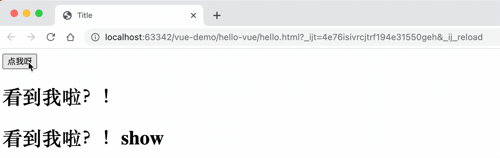 

### 5.5.2 与v-for结合

当`v-if`和`v-for`出现在一起时，`v-for`优先级更高。也就是说，会先遍历，再判断条件。

修改`v-for`中的案例，添加`v-if`：

```html
<ul>
  <li v-for="(user, index) in users" v-if="user.gender == '女'">
    {{index + 1}}. {{user.name}} - {{user.gender}} - {{user.age}}
  </li>
</ul>
```

效果：

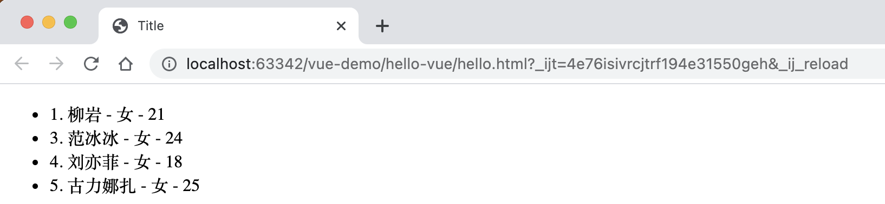  

只显示女性用户信息

### 5.5.3 v-else

你可以使用 `v-else` 指令来表示 `v-if` 的“else 块”：

```html
<div id="app">
  <h1 v-if="Math.random() > 0.5">
    看到我啦？！if
  </h1>
  <h1 v-else>
    看到我啦？！else
  </h1>
</div>
```

`v-else` 元素必须紧跟在带 `v-if` 或者 `v-else-if` 的元素的后面，否则它将不会被识别。

`v-else-if`，顾名思义，充当 `v-if` 的“else-if 块”，可以连续使用：

```html
<div id="app">
  <button v-on:click="random=Math.random()">点我呀</button><span>{{random}}</span>
  <h1 v-if="random >= 0.75">
    看到我啦？！if
  </h1>
  <h1 v-else-if="random > 0.5">
    看到我啦？！if 0.5
  </h1>
  <h1 v-else-if="random > 0.25">
    看到我啦？！if 0.25
  </h1>
  <h1 v-else>
    看到我啦？！else
  </h1>
</div>
<script src="./node_modules/vue/dist/vue.js"></script>
<script type="text/javascript">
  var app = new Vue({
    el: "#app",
    data: {
      random: 1
    }
  })
</script>
```

类似于 `v-else`，`v-else-if` 也必须紧跟在带 `v-if` 或者 `v-else-if` 的元素之后。

演示：

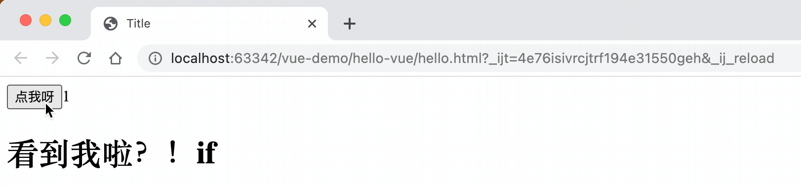 

### 5.5.4 v-show

另一个用于根据条件展示元素的选项是 `v-show` 指令。用法大致一样：

```html
<h1 v-show="ok">Hello!</h1>
```

不同的是带有 `v-show` 的元素始终会被渲染并保留在 DOM 中。`v-show` 只是简单地切换元素的 CSS 属性 `display`。

示例：

```html
<div id="app">
  <!--事件中直接写js片段-->
  <button v-on:click="show = !show">点击切换</button>
  <br/>
  <h1 v-if="show">
    你好
  </h1>
</div>
<script src="./node_modules/vue/dist/vue.js"></script>
<script type="text/javascript">
  var app = new Vue({
    el: "#app",
    data: {
      show: true
    }
  })
</script>
```

效果：

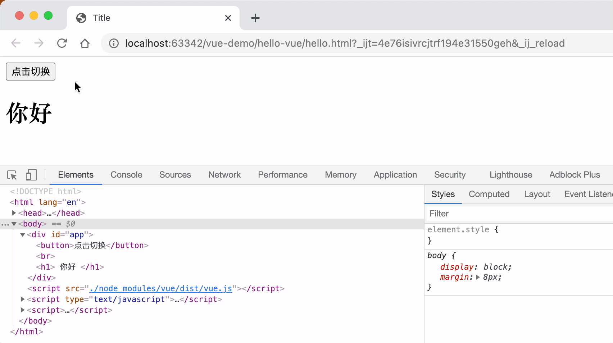 

## 5.6 v-bind

### 5.6.1 属性上使用vue数据

看这样一个案例：

我们提前定义了一些CSS样式

```css
div {
  width: 100px;
  height: 100px;
  color: darkgray;
}
.red {
  background-color: red;
}
.blue {
  background-color: blue;
}
```

然后定义了页面：

```html
<div id="app">
  <button @click="color='red'">红</button>
  <button @click="color='blue'">蓝</button>
  <div class="">
    点击按钮, 背景会切换颜色哦
  </div>
</div>
<script src="./node_modules/vue/dist/vue.js"></script>
<script type="text/javascript">
  var app = new Vue({
    el: "#app",
    data: {
      color: "red", // 代表当前的class样式, 目前是红
    }
  });
</script>
```

解读：

- 页面有两个按钮，点击时，会改变Vue实例中的color值，这个值与前面定义的CSS样式一致。
- 目前div的class为空，我们希望实现点击按钮后，div的class样式会在`.red`和`.blue`之间切换

该如何实现？

大家可能会这么想，既然color值会动态变化为不同的class名称，那么我们直接把color注入到class属性就好了，于是就这样写：

```html
<div class="{{color}}"></div>
```

这样写是错误的！因为插值表达式不能用在标签的属性中。


此时，Vue提供了一个新的指令来解决：`v-bind`，语法：

```
v-bind:属性名="Vue中的变量"
```

例如，在这里我们可以写成：

```html
<div v-bind:class="color"></div>
```

不过，v-bind太麻烦，因此可以省略，直接写成`:属性名='属性值'`，即：

```vue
<div :class="color"></div>
```

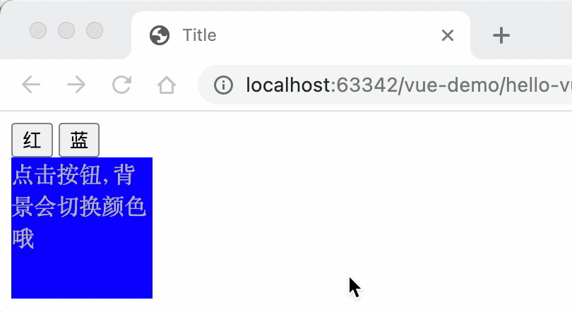 

### 5.6.2 class属性的特殊用法

上面虽然实现了颜色切换，但是语法却比较啰嗦。

Vue对class属性进行了特殊处理，可以接收数组或对象格式

> 对象语法

我们可以传给`:class`一个对象，以动态地切换class：

```vue
<div :class="{red: true, blue: false}"></div>
```

- 对象中，key是已经定义的class样式的名称，如本例中的：`:red`和`:blue`
- 对象中，value是一个布尔值，如果为true，则这个样式会生效，如果为false，则不生效。

之前的案例可以改写成这样：

```vue
<div id="app">
  <button @click="boo=!boo">点击切换背景</button>
  <div :class="{red: boo, blue: !boo}">
    点击按钮, 背景会切换颜色哦
  </div>
</div>
<script src="./node_modules/vue/dist/vue.js"></script>
<script type="text/javascript">
  var app = new Vue({
    el: "#app",
    data: {
      boo: true, //一个布尔标记,判断样式是否生效
    }
  });
</script>
```

- 首先class绑定的是一个对象：`{red: boo, blue: !boo}`
  - red和blue两个样式的值分别是`boo`和`!boo`，也就是说这两个样式的生效标记刚好相反，一个生效，另一个失效。
  - boo默认为true，也就是说默认red生效，blue不生效
- 现在只需要一个按钮即可，点击时对boo取反，自然实现了样式的切换

效果：

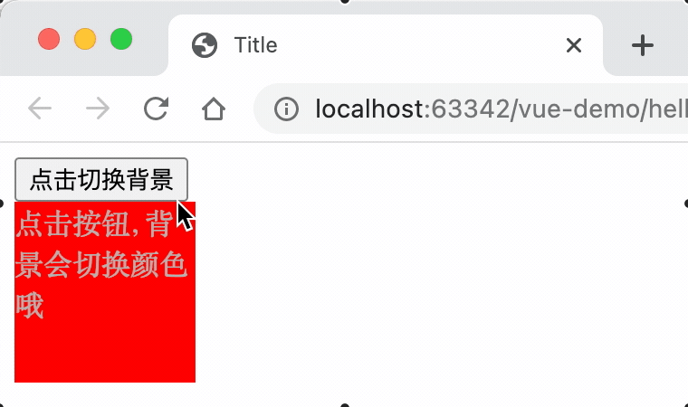 

## 5.7 计算属性

在插值表达式中使用js表达式是非常方便的，而且也经常被用到。

但是如果表达式的内容很长，就会显得不够优雅，而且后期维护起来也不方便，例如下面的场景，我们有一个日期的数据，但是是毫秒值：

```js
data: {
  birthday: 1529032123201 // 毫秒值
}
```

我们在页面渲染，希望得到yyyy-MM-dd的样式：

```html
<h1>您的生日是：{{
  new Date(birthday).getFullYear() + '-'+ new Date(birthday).getMonth()+ '-' + new Date(birthday).getDay()
  }}
</h1>
```

虽然能得到结果，但是非常麻烦。

Vue中提供了计算属性，来替代复杂的表达式：

```js
var vm = new Vue({
  el: "#app",
  data: {
    birthday: 1929032123201 // 毫秒值
  },
  computed:{
    birth(){// 计算属性本质是一个方法，但是必须返回结果
      const d = new Date(this.birthday);
      return d.getFullYear() + "-" + d.getMonth() + "-" + d.getDay();
    }
  }
})
```

- 计算属性本质就是方法，但是一定要返回数据。然后页面渲染时，可以把这个方法当成一个变量来使用。

页面使用：

```html
<div id="app">
  <h1>您的生日是：{{birth}} </h1>
</div>
```

效果：

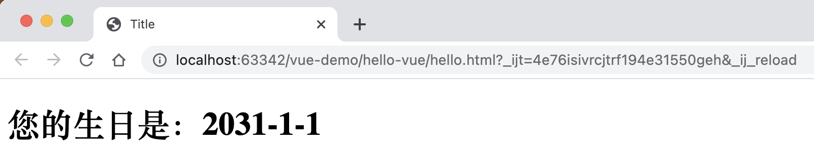  

我们可以将同一函数定义为一个方法而不是一个计算属性。两种方式的最终结果确实是完全相同的。然而，不同的是**计算属性是基于它们的依赖进行缓存的**。计算属性只有在它的相关依赖发生改变时才会重新求值。这就意味着只要`birthday`还没有发生改变，多次访问 `birthday` 计算属性会立即返回之前的计算结果，而不必再次执行函数。 

## 5.8 watch

### 5.8.1 监控

watch可以让我们监控一个值的变化。从而做出相应的反应。

示例：

```html
<div id="app">
  <input type="text" v-model="message">
</div>
<script src="./node_modules/vue/dist/vue.js"></script>
<script type="text/javascript">
  var vm = new Vue({
    el:"#app",
    data:{
      message:""
    },
    watch:{
      message(newVal, oldVal){
        console.log(newVal, oldVal);
      }
    }
  })
</script>
```

效果：

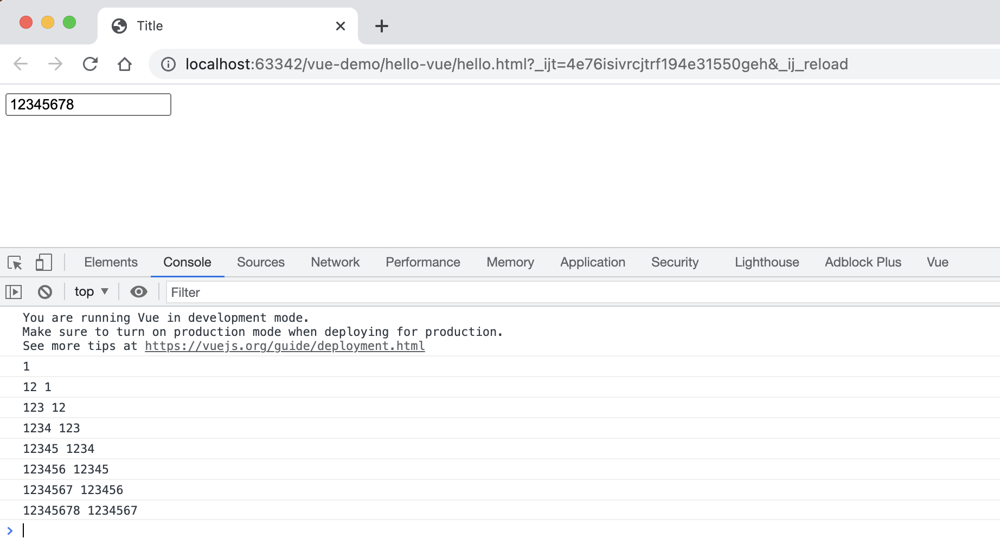  

### 5.8.2 深度监控

如果监控的是一个对象，需要进行深度监控，才能监控到对象中属性的变化，例如：

```vue
<div id="app">
  姓名: <input type="text" v-model="person.name"> <br>
  年龄: <input type="text" v-model="person.age"> <button @click="person.age++">+</button>
  <br>
  <h1>
    {{person.name}} 今年 {{person.age}} 岁了.
  </h1>
</div>
<script src="./node_modules/vue/dist/vue.js"></script>
<script type="text/javascript">
  var app = new Vue({
    el: "#app",
    data: {
      person: {
        name: "Jack",
        age: 21
      }
    },
    watch: {
      person: {
        deep: true, // 开启深度监控, 可以监控到对象中属性变化
        handler(val) { // 定义监控到以后的处理方法
          console.log(val.name + " : " + val.age)
        }
      }
    }
  });
</script>
```

变化：

- 以前定义监控时，person是一个函数，现在改成了对象，并且要指定两个属性：
  - deep：代表深度监控，不仅监控person变化，也监控person中属性变化
  - handler：就是以前的监控处理函数

效果：

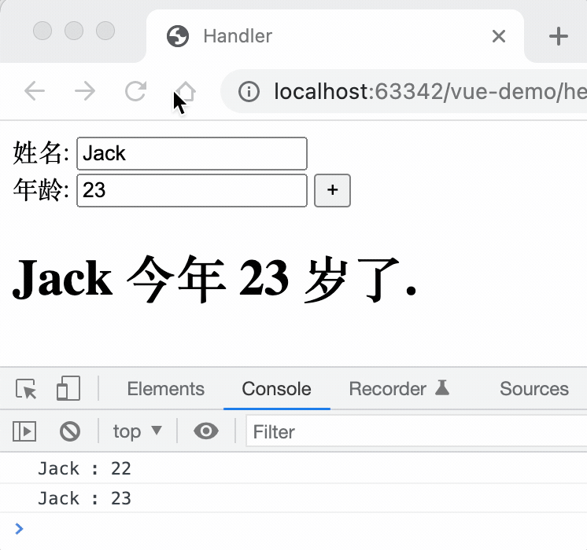 

# 6 组件化

在大型应用开发的时候，页面可以划分成很多部分。往往不同的页面，也会有相同的部分。例如可能会有相同的头部导航。

但是如果每个页面都独自开发，这无疑增加了我们开发的成本。所以我们会把页面的不同部分拆分成独立的组件，然后在不同页面就可以共享这些组件，避免重复开发。

## 6.1 定义全局组件

我们通过Vue的component方法来定义一个全局组件。

```html
<div id="app">
  <!--使用定义好的全局组件-->
  <counter></counter>
</div>
<script src="./node_modules/vue/dist/vue.js"></script>
<script type="text/javascript">
  // 定义全局组件，两个参数：1，组件名称。2，组件参数
  Vue.component("counter",{
    template:'<button @click="count++">你点了我 {{ count }} 次，我记住了.</button>',
    data: function(){
      return {
        count:0
      }
    }
  })
  var app = new Vue({
    el:"#app"
  })
</script>
```

- 组件其实也是一个Vue实例，因此它在定义时也会接收：data、methods、生命周期函数等
- 不同的是组件不会与页面的元素绑定，否则就无法复用了，因此没有el属性。
- 但是组件渲染需要html模板，所以增加了template属性，值就是HTML模板
- 全局组件定义完毕，任何vue实例都可以直接在HTML中通过组件名称来使用组件了。
- data必须是一个函数，不再是一个对象。

效果：

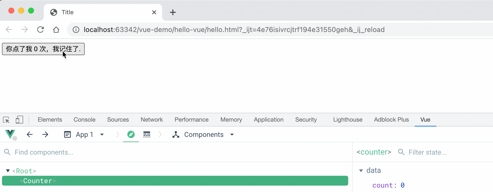 

## 6.2 组件的复用

定义好的组件，可以任意复用多次：

```html
<div id="app">
  <!--使用定义好的全局组件-->
  <counter></counter>
  <counter></counter>
  <counter></counter>
</div>
```

效果：

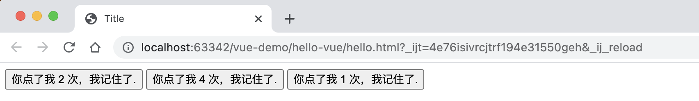 

你会发现每个组件互不干扰，都有自己的count值。怎么实现的？

> **组件的data属性必须是函数**！

当我们定义这个 `<counter>` 组件时，它的data 并不是像这样直接提供一个对象：

```js
data: {
  count: 0
}
```

取而代之的是，一个组件的 data 选项必须是一个函数，因此每个实例可以维护一份被返回对象的独立的拷贝：

```js
data: function () {
  return {
    count: 0
  }
}
```

如果 Vue 没有这条规则，点击一个按钮就会影响到其它所有实例！

## 6.3 局部注册

一旦全局注册，就意味着即便以后你不再使用这个组件，它依然会随着Vue的加载而加载。

因此，对于一些并不频繁使用的组件，我们会采用局部注册。

我们先在外部定义一个对象，结构与创建组件时传递的第二个参数一致：

```js
const counter = {
  template:'<button v-on:click="count++">你点了我 {{ count }} 次，我记住了.</button>',
  data: function(){
    return {
      count:0
    }
  }
};
```

然后在Vue中使用它：

```js
var app = new Vue({
  el: "#app",
  components: {
    counter: counter // 将定义的对象注册为组件
  }
})
```

- components就是当前vue对象子组件集合。
  - 其key就是子组件名称
  - 其值就是组件对象的属性
- 效果与刚才的全局注册是类似的，不同的是，这个counter组件只能在当前的Vue实例中使用

## 6.4 组件通信

通常一个单页应用会以一棵嵌套的组件树的形式来组织：

 

- 页面首先分成了顶部导航、左侧内容区、右侧边栏三部分
- 左侧内容区又分为上下两个组件
- 右侧边栏中又包含了3个子组件

各个组件之间以嵌套的关系组合在一起，那么这个时候不可避免的会有组件间通信的需求。

### 6.4.1 父向子传递props

比如我们有一个子组件：

```js
Vue.component("introduce",{
  // 直接使用props接收到的属性来渲染页面
  template:'<h1>{{title}}</h1>',
  props:['title'] // 通过props来接收一个父组件传递的属性
})
```

- 这个子组件中要使用title属性渲染页面，但是自己并没有title属性
- 通过props来接收父组件属性，名为title

父组件使用子组件，同时传递title属性：

```html
<div id="app">
  <h1>打个招呼：</h1>
  <!--使用子组件，同时传递title属性-->
  <introduce :title="msg"/>
</div>
<script src="./node_modules/vue/dist/vue.js"></script>
<script type="text/javascript">
  Vue.component("introduce",{
    // 直接使用props接收到的属性来渲染页面
    template:'<h1>{{title}}</h1>',
    props:['title'] // 通过props来接收一个父组件传递的属性
  })
  var app = new Vue({
    el:"#app",
    data: {
      msg: "大家好，我是宝姐"
    }
  })
</script>
```

效果：

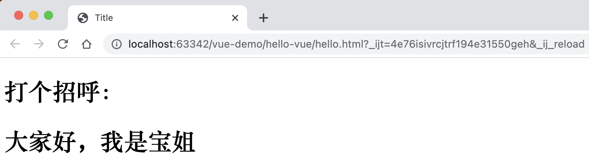  

### 6.4.2 传递复杂数据

我们定义一个子组件：

```json
const myList = {    
  template: '\
    <ul>\
    <li v-for="item in items" :key="item.id">{{item.id}} : {{item.name}}</li>\
    </ul>\
    ',
  props: { // 通过props来接收父组件传来的属性
  	items: { // 这里定义items属性
  		type: Array, // 要求必须是Array类型
  		default: [], // 如果父组件没有传，那么给定默认值是[]
			required: true
		}
	}
};
```

- 这个子组件可以对 items 进行迭代，并输出到页面。
- 但是组件中并未定义items属性。
- 通过props来定义需要从父组件中接收的属性
  - items：是要接收的属性名称
    - type：限定父组件传递来的必须是数组，否则报错
    - default：默认值
    - required：是否必须

**当 prop 验证失败的时候，(开发环境构建版本的) Vue 将会产生一个控制台的警告。** 

我们在父组件中使用它：

```html
<div id="app">
  <h2>指针信息已开设如下课程：</h2>
  <!-- 使用子组件的同时，传递属性，这里使用了v-bind，指向了父组件自己的属性lessons -->
  <my-list :items="lessons"/>
</div>
```

```js
var app = new Vue({
  el: "#app",
  components: {
    myList // 当key和value一样时，可以只写一个
  },
  data: {
    lessons: [
      {id: 1, name: 'java'},
      {id: 2, name: 'C++'},
    ]
  }
})
```

效果：

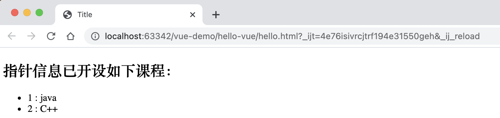 

type类型，可以有：

  

### 6.4.3 子向父的通信

来看这样的一个案例：

```html
<div id="app">
    <h2>num: {{num}}</h2>
    <!--使用子组件的时候，传递num到子组件中-->
    <counter :num="num"></counter>
</div>
<script src="./node_modules/vue/dist/vue.js"></script>
<script type="text/javascript">
    Vue.component("counter", {// 子组件，定义了两个按钮，点击数字num会加或减
        template:'\
            <div>\
                <button @click="num++">加</button>  \
                <button @click="num--">减</button>  \
            </div>',
        props:['num']// num是从父组件获取的。
    })
    var app = new Vue({
        el:"#app",
        data:{
            num:0
        }
    })
</script>
```

- 子组件接收父组件的num属性
- 子组件定义点击按钮，点击后对num进行加或减操作

我们尝试运行，好像没问题，点击按钮试试：

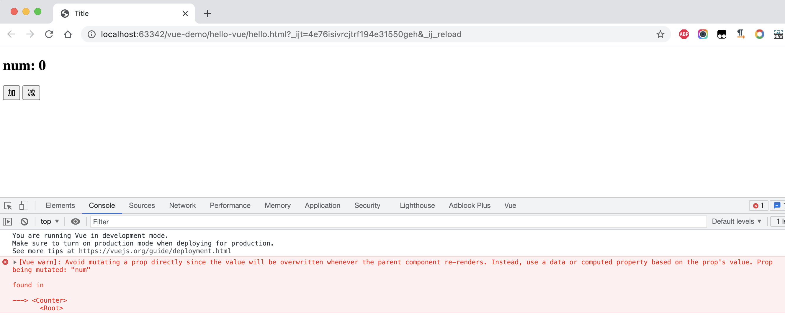  

子组件接收到父组件属性后，默认是不允许修改的。怎么办？

既然只有父组件能修改，那么加和减的操作一定是放在父组件：

```js
var app = new Vue({
  el: "#app",
  data: {
    num: 0
  },
  methods: { // 父组件中定义操作num的方法
    handlePlus() {
      this.num++;
    },
    handleReduce() {
      this.num--;
    }
  }
})
```

但是，点击按钮是在子组件中，那就是说需要子组件来调用父组件的函数，怎么做？

我们可以**通过v-on指令将父组件的函数绑定到子组件**上：

```html
<div id="app">
  <h2>num: {{num}}</h2>
  <counter @plus="handlePlus" @reduce="handleReduce"></counter>
</div>
```

当子组件中按钮被点击时，调用绑定的函数：

```json
Vue.component("counter", {
        template: '\
                <div>\
                    <button @click="increment">加</button>  \
                    <button @click="decrement">减</button>  \
                </div>',
        props: ['count'],
        methods: {
            increment() {
                this.$emit("plus");
            },
            decrement() {
                this.$emit("reduce");
            }
        }
    })
```

- vue提供了一个内置的this.$emit()函数，用来调用父组件绑定的函数

效果：

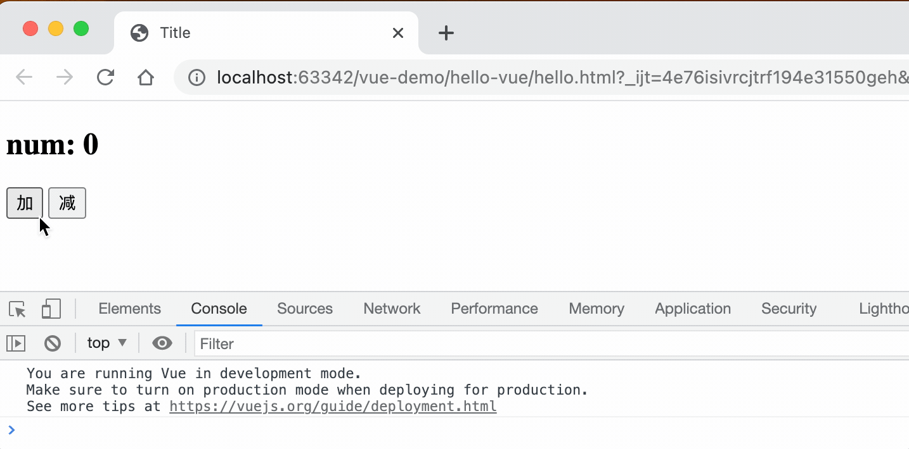  

子组件不能直接修改父组件传递参数的引用或者基本类型参数值。子组件可以修改父组件对象类型参数的属性

# 7 路由vue-router

## 7.1 场景模拟

现在我们来实现这样一个功能：

一个页面，包含登录和注册，点击不同按钮，实现登录和注册页切换

### 7.1.1 编写父组件

为了让接下来的功能比较清晰，我们先新建一个文件夹：src

然后新建一个HTML文件，作为入口：index.html

 

然后编写页面的基本结构：

```html
<div id="app">
  <span>登录</span>
  <span>注册</span>
  <hr/>
  <div>
    登录页/注册页
  </div>
</div>
<script src="../node_modules/vue/dist/vue.js"></script>
<script type="text/javascript">
  var vm = new Vue({
    el: "#app"
  })
</script>
```

样式：

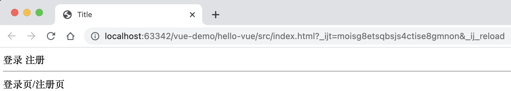  

### 7.1.2 编写登录及注册组件

接下来我们来实现登录组件，以前我们都是写在一个文件中，但是为了复用性，开发中都会把组件放入独立的JS文件中，我们新建一个user目录以及login.js及register.js：

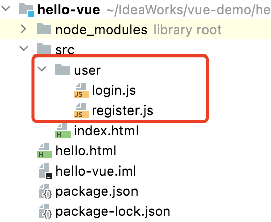 

编写组件，这里我们只写模板，不写功能。

login.js内容如下：

```js
const loginForm = {
    template: '\
    <div>\
    <h2>登录页</h2> \
    用户名：<input type="text"><br/>\
    密&emsp;码：<input type="password"><br/>\
    </div>\
    '
}
```

register.js内容：

```js
const registerForm = {
    template:'\
    <div>\
    <h2>注册页</h2> \
    用&ensp;户&ensp;名：<input type="text"><br/>\
    密&emsp;&emsp;码：<input type="password"><br/>\
    确认密码：<input type="password"><br/>\
    </div>\
    '
}
```

### 7.1.3 在父组件中引用

```html
<div id="app">
    <span>登录</span>
    <span>注册</span>
    <hr/>
    <div>
        <!--<loginForm></loginForm>-->
        <!--
            疑问：为什么不采用上面的写法？
            由于html是大小写不敏感的，如果采用上面的写法，则被认为是<loginform></loginform>
            所以，如果是驼峰形式的组件，需要把驼峰转化为“-”的形式
         -->
        <login-form></login-form>
        <register-form></register-form>
    </div>
</div>
<script src="../node_modules/vue/dist/vue.js"></script>
<script src="user/login.js"></script>
<script src="user/register.js"></script>
<script type="text/javascript">
    var vm = new Vue({
        el: "#app",
        components: {
            loginForm,
            registerForm
        }
    })
</script>
```

效果：

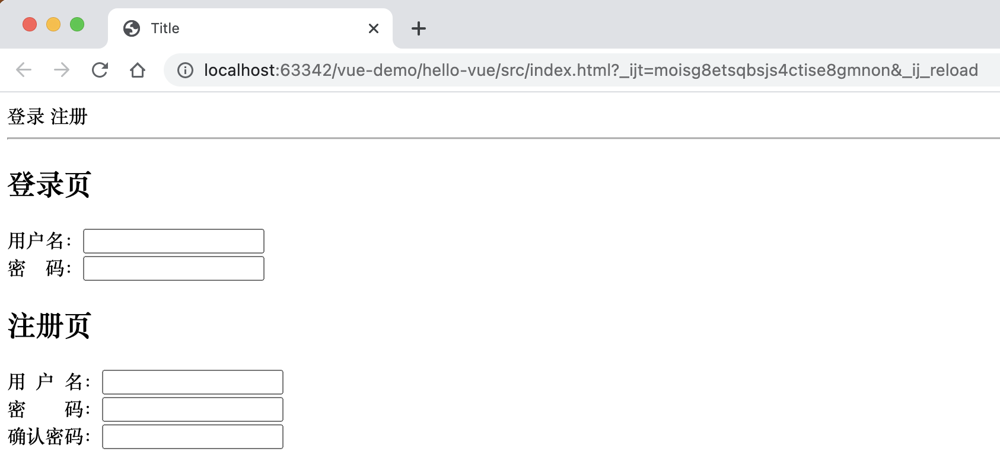 

### 7.1.4 问题

我们期待的是，当点击登录或注册按钮，分别显示登录页或注册页，而不是一起显示。

但是，如何才能动态加载组件，实现组件切换呢？

虽然使用原生的Html5和JS也能实现，但是官方推荐我们使用vue-router模块。

## 7.2 vue-router简介和安装

使用vue-router和vue可以非常方便的实现 复杂单页应用的动态路由功能。

官网：https://router.vuejs.org/zh-cn/

使用npm安装：`npm install vue-router --save` 

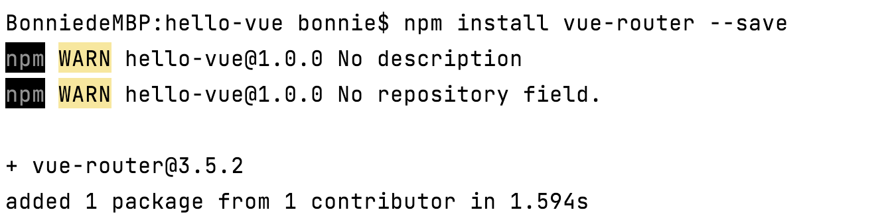 

在index.html中引入依赖：

```html
<script src="../node_modules/vue-router/dist/vue-router.js"></script>
```

## 7.3 快速入门

新建vue-router对象，并且指定路由规则：

```js
// 创建VueRouter对象
const router = new VueRouter({
  routes: [ // 编写路由规则
    {
      path: "/login", // 请求路径
      component: loginForm // 组件名称
    },
    {
      path: "/register",
      component: registerForm
    },
  ]
})
```

- 创建VueRouter对象，并指定路由参数
- routes：路由规则的数组，可以指定多个对象，每个对象是一条路由规则，包含以下属性：
  - path：路由的路径
  - component：组件名称

在父组件中引入router对象：

```javascript
var vm = new Vue({
  el: "#app",
  components: {// 引用登录和注册组件
    loginForm,
    registerForm
  },
  router // 引用上面定义的router对象
})
```

页面跳转控制：

```html
<div id="app">
  <!--router-link来指定跳转的路径-->
  <span><router-link to="/login">登录</router-link></span>
  <span><router-link to="/register">注册</router-link></span>
  <hr/>
  <div>
    <!--vue-router的锚点-->
    <router-view></router-view>
  </div>
</div>
```

- 通过`<router-view>`来指定一个锚点，当路由的路径匹配时，vue-router会自动把对应组件放到锚点位置进行渲染
- 通过`<router-link>`指定一个跳转链接，当点击时，会触发vue-router的路由功能，路径中的hash值会随之改变

效果：

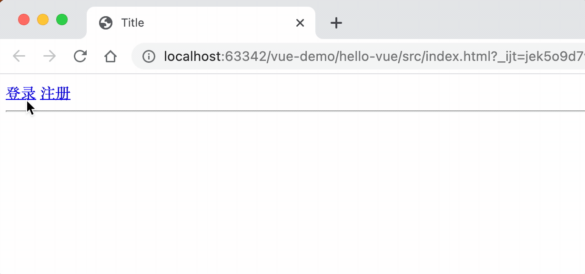 

**注意**：单页应用中，页面的切换并不是页面的跳转。仅仅是地址最后的hash值变化。

事实上，我们总共就一个HTML：index.html


# Webpack

在项目中安装webpack

```bash
npm install webpack@5.42.1 webpack-cli@4.7.2 -D
```

-S 是--save 的简写

-D 是 --save-dev 的简写


编写webpack配置  webpack.config.js

```js
module.exports = {
  mode: "develpment" // mode用来指定构建模式，可选值有 development 和 production
}
```

在package.json的scripts节点下，新增dev脚本如下：

```json
"scripts": {
  "dev": "webpack" // script 节点下的脚本，可以通过 npm run 执行，例如 npm run dev
}
```


```js
const path = require('path') // 导入node.js 中专门操作路径的模块
module.exports = {
  mode: "develpment", // mode用来指定构建模式，可选值有 development 和 production
  // entry: 指定要处理哪个文件
  entry: path.join(__dirname, './src/index1.js'),
  // 指定生成的文件要存放到哪里
  output: {
    // 存放的目录
    path: path.join(__dirname, 'dist'),
    // 生成的文件名
    filename: 'bundle.js'
  }
}
```


# 8 VueJS ajax

## 8.1 vue-resource

vue-resource 是 Vue.js 的插件提供了使用 XMLHttpRequest 或 JSONP 进行 Web 请求和处理响应的服务。当 vue 更新到 2.0 之后，作者就宣告不再对 vue-resource 更新，而是推荐的 axios，在这里大家了解一下 vue-resource 就可以。

vue-resource 的 github：https://github.com/pagekit/vue-resource

## 8.2 axios

Axios 是一个基于 promise 的 HTTP 库，可以用在浏览器和 node.js 中

axios 的 github：https://github.com/axios/axios

### 8.2.1 引入axios

使用npm安装 axios ：

```bash
npm install axios --save
```

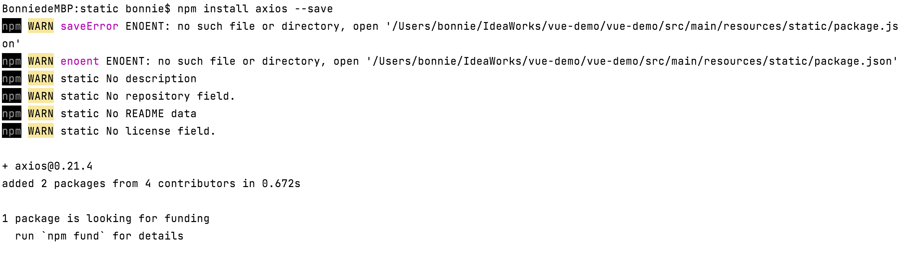 

引入

```html
<script src="node_modules/axios/dist/axios.min.js"></script>
```

### 8.2.2 get请求

```javascript
// 通过给定的ID来发送请求
axios.get('/user?ID=12345')
  .then(function(response){
  	console.log(response);
	})
  .catch(function(err){
  	console.log(err);
	}); 
// 以上请求也可以通过这种方式来发送
axios.get('/user',{
  params:{
    ID:12345
  }
})
  .then(function(response){
  console.log(response);
})
  .catch(function(err){
  console.log(err);
});
```

### 8.2.3 post请求

```javascript
axios.post('/user',{
  firstName:'Fred',
  lastName:'Flintstone'
})
  .then(function(res){
  	console.log(res);
})
  .catch(function(err){
  	console.log(err);
});
```

为方便起见，为所有支持的请求方法提供了别名

**axios.request(config)**

**axios.get(url[, config])**

**axios.delete(url[, config])**

**axios.head(url[, config])**

**axios.post(url[, data[, config]])**

**axios.put(url[, data[, config]])**

**axios.patch(url[, data[, config]])**

# 9 综合案例

## 9.1 案例需求

完成用户的查询与修改操作

## 9.2 数据库设计与表结构

```sql
CREATE DATABASE vuejsdemo;
USE vuejsdemo;
CREATE TABLE USER(
  id INT PRIMARY KEY AUTO_INCREMENT,
  age INT,
  username VARCHAR(20),
  PASSWORD VARCHAR(50),
  email VARCHAR(50),
  sex VARCHAR(20)
)
```

User 类

```java
@Data
public class User {
  @Id
  private Integer id;
  private String username;
  private String password;
  private String sex;
  private Integer age;
  private String email;
}
```

## 9.3 服务器端

### 9.3.1 配置文件

pom.xml

```xml
<?xml version="1.0" encoding="UTF-8"?>
<project xmlns="http://maven.apache.org/POM/4.0.0"
         xmlns:xsi="http://www.w3.org/2001/XMLSchema-instance"
         xsi:schemaLocation="http://maven.apache.org/POM/4.0.0 http://maven.apache.org/xsd/maven-4.0.0.xsd">
  <modelVersion>4.0.0</modelVersion>

  <parent>
    <artifactId>spring-boot-starter-parent</artifactId>
    <groupId>org.springframework.boot</groupId>
    <version>2.5.4</version>
  </parent>
  <groupId>com.zzxx</groupId>
  <artifactId>vue-demo</artifactId>
  <version>1.0-SNAPSHOT</version>

  <dependencies>
    <dependency>
      <groupId>org.springframework.boot</groupId>
      <artifactId>spring-boot-starter-web</artifactId>
    </dependency>
    <dependency>
      <groupId>org.springframework.boot</groupId>
      <artifactId>spring-boot-starter-test</artifactId>
    </dependency>
    <dependency>
      <groupId>mysql</groupId>
      <artifactId>mysql-connector-java</artifactId>
    </dependency>
    <dependency>
      <groupId>tk.mybatis</groupId>
      <artifactId>mapper-spring-boot-starter</artifactId>
      <version>2.1.5</version>
    </dependency>
    <dependency>
      <groupId>org.projectlombok</groupId>
      <artifactId>lombok</artifactId>
    </dependency>
  </dependencies>

</project>
```

application.yml

```yml
spring:
  datasource:
    url: jdbc:mysql:///vue
    username: root
    password: root
```

### 9.3.2 Controller

```java
@RequestMapping("/user")
@RestController
public class UserController {
  @Autowired
  private UserService userService;

  @RequestMapping(value = "/findAll.do")
  public List<User> findAll() {
    return userService.findAll();
  }

  @RequestMapping(value = "/findById.do")
  public User findById(Integer id) {
    return userService.findById(id);
  }

  @RequestMapping(value = "/update.do")
  public User update(@RequestBody User user) {
    return userService.update(user);
  }
}
```

### 9.3.3 Service

```java
@Service
public class UserServiceImpl implements UserService {
  @Autowired
  private UserMapper userMapper;
  @Override
  public List<User> findAll() {
    return userMapper.selectAll();
  }

  @Override
  public User findById(Integer id) {
    return userMapper.selectByPrimaryKey(id);
  }

  @Override
  public User update(User user) {
    userMapper.updateByPrimaryKeySelective(user);
    return user;
  }
}
```

## 9.4 客户端

### 9.4.1 user.html页面

```html
<body>
  <div id="app">
    <table id="dataList">
      <thead>
        <tr>
          <th><input id="selall" type="checkbox"></th>
          <th class="sorting_asc">ID</th>
          <th class="sorting_desc">用户名</th>
          <th class="sorting_asc sorting_asc_disabled">密码</th>
          <th class="sorting_desc sorting_desc_disabled">性别</th>
          <th class="sorting">年龄</th>
          <th class="text-center sorting">邮箱</th>
          <th class="text-center">操作</th>
        </tr>
      </thead>
      <tbody>
        <tr v-for="u in userList">
          <td><input name="ids" type="checkbox"></td>
          <td>{{u.id}}</td>
          <td>{{u.username}}</td>
          <td>{{u.password}}</td>
          <td>{{u.sex}}</td>
          <td>{{u.age}}</td>
          <td>{{u.email}}</td>
          <td>
            <button type="button" @click="findById(u.id)">编辑</button>
          </td>
        </tr>
      </tbody>
    </table>
    <!--模态窗口-->
    <h4>用户信息</h4>
    <label >用户名:</label>
    <input type="text" v-model="user.username"><br>
    <label >密码:</label>
    <input type="text" v-model="user.password"><br>
    <label >性别:</label>
    <input type="text" v-model="user.sex"><br>
    <label >年龄:</label>
    <input type="text" v-model="user.age"><br>
    <label >邮箱:</label>
    <input type="text" v-model="user.email"><br>
    <button type="button" @click="update">修改</button>
  </div>
  <script src="node_modules/vue/dist/vue.js"></script>
  <script src="node_modules/axios/dist/axios.min.js"></script>
  <script src="js/user.js"></script>
```

### 9.4.2 user.js页面

```javascript
var vue = new Vue({
  el: "#app",
  data: {
    user: {id: "", username: "", password: "", age: "", sex: "", email: ""},
    userList: []
  }, methods: {
    findAll: function () {
      var _this = this;
      axios.get("/user/findAll.do").then(function (response) {
        _this.userList = response.data;
        console.log(_this.userList);
      }).catch(function (err) {
        console.log(err);
      });
    },
    findById: function (userid) {
      var _this = this;
      axios.get("/user/findById.do", {
        params: {
          id: userid
        }
      }).then(function (response) {
        _this.user = response.data;
        $('#myModal').modal("show");
      }).catch(function (err) {
      });
    },
    update: function (user) {
      var _this = this;
      axios.post("/user/update.do", _this.user).then(function (response) {
        _this.findAll();
      }).catch(function (err) {
      });
    }
  },
  created() {
    this.findAll();
  }
});
```

### 9.4.3 测试效果

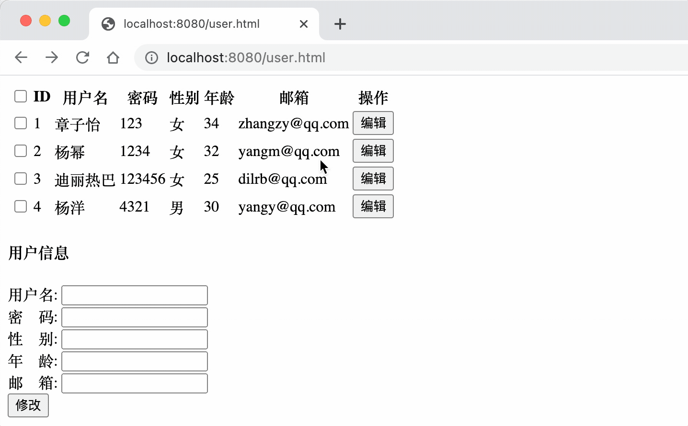 
